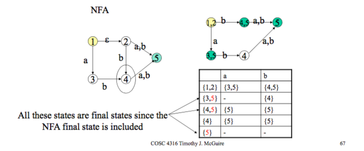

---
    - Notes on 02-07-18
    - Computer Operating Systems
    - Slide: Lexical Analysis 40 ——
    - References:
---

### Converting From Regular Expression to NFA

#### (Thompson's Construction)

> *note*: we base this directly from the definition of Regex's
>The **regular expressions** over finite ...???

## Converting from an NFS to DFA

The epsilon closure of the set of states T is that + all NFA states that are reachable.

#### Example 1: Subset construction Slide 63

| State     | A   | B   |
| --------- | --- | --- |
| A = {1,2} | B   | C   |
| B = {3,5} | —- | D   |
| C = {4,5} | E   | E   |
| D = {4}   | E   | E   |
| E = {5}   | --  | --  |

## Coming Attractions! 🎊❗

Slide 72

